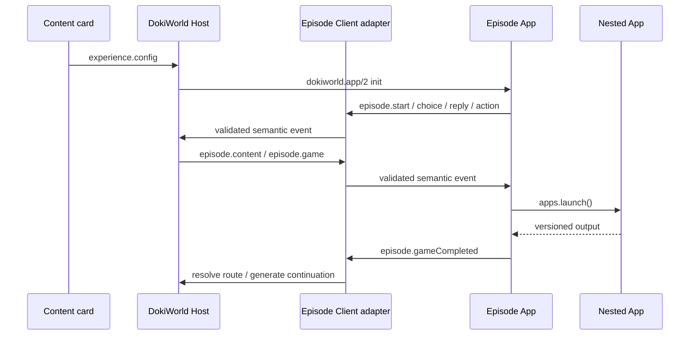

# DokiWorld App SDK：App 开发、协议与交付指南

本文是使用 `@dokiworld/app-sdk` 开发 DokiWorld iframe App 的规范指南。所有 iframe 交互内容都使用同一种 App 模型；是否允许对话拉起以及需要哪些 Host capability，均由 manifest 字段声明，而不是由预设内容类型决定。可运行示例参考 [dokiworld-apps](https://github.com/raptoravis/dokiworld-apps)；仓库中的 `game-match3`、`storyteller` 与 `banquet-contract` 展示不同交互流程的 App。

UI Extension 不属于 iframe App。它使用 `@dokiworld/extension-sdk`，安装和运行模型见 [`ui-extension-system.zh-CN.md`](ui-extension-system.zh-CN.md)。

## 1. 架构与事实来源

App 是独立构建、独立部署的浏览器静态包，通过 `dokiworld.app/2` 与 Host 通信：

```text
App source
  ├─ package.json                 npm 依赖与唯一版本来源
  ├─ manifest source/generator   App 身份、选择语义、contract、capability
  └─ source assets
          │ npm run build
          ▼
dist/
  ├─ manifest.json
  ├─ index.html
  ├─ bundled JavaScript/CSS
  └─ runtime assets
          │ sync / upload / publish
          ▼
DokiWorld catalog → iframe Host ↔ @dokiworld/app-sdk ↔ App
```

规则：

- App 不导入 DokiWorld `frontend/src` 或 backend 内部模块。
- `package.json.version` 是发布版本的唯一事实来源；manifest 生成器把它写入 manifest。
- `dist/manifest.json` 是交付清单，不手工编辑 `dist/`。
- App manifest 自包含启停状态、启动策略、context scopes 和 runtime contract，不需要额外的 `external-apps.json`。
- 对于 `schemaVersion >= 3`，`selection.promptHint` 是对话拉起资格的唯一来源；只有同时提供有效双语提示的 App 才进入候选。其他 App 从明确的产品入口启动。
- 英文是规范产品语言，同时维护对应的简体中文内容。

## 2. 建立项目

推荐结构：

```text
my-app/
├─ package.json
├─ package-lock.json
├─ src/
│  ├─ index.html
│  ├─ app.js
│  └─ manifest.json              # 或由生成脚本输出
├─ scripts/
│  ├─ generate-manifest.mjs
│  └─ build.mjs
├─ tests/
└─ dist/
```

从公共 npm registry 安装 SDK：

```powershell
npm install "@dokiworld/app-sdk@^3.0.0" --save
```

只有联合开发尚未发布的 SDK 变更时，才临时使用相邻仓库：

```json
{
  "dependencies": {
    "@dokiworld/app-sdk": "file:../../dokiworld.git/packages/app-sdk"
  }
}
```

提交或发布 App 前恢复公共 semver 依赖并刷新 lockfile。构建器应把 SDK 打入浏览器 bundle，因此部署环境无需安装 npm 包。

`package.json` 至少提供：

```json
{
  "type": "module",
  "scripts": {
    "generate:manifest": "node scripts/generate-manifest.mjs",
    "test": "node --test tests/*.test.mjs",
    "build": "node scripts/build.mjs"
  },
  "dependencies": {
    "@dokiworld/app-sdk": "^3.0.0"
  }
}
```

## 3. App manifest

新 App 使用 `schemaVersion: 3`。下面是一个可由对话拉起并返回标准结算结果的完整示例：

```json
{
  "schemaVersion": 3,
  "version": "1.0.0",
  "id": "my-app",
  "status": "active",
  "capability": "app.puzzle.example",
  "entry": "index.html",
  "cover": "assets/cover.webp",
  "launchRequirements": {
    "minPlayers": 2
  },
  "context": {
    "requiredScopes": [],
    "optionalScopes": ["character.identity", "character.avatar"]
  },
  "locales": {
    "en": {
      "name": "Example Puzzle App",
      "description": "A short cooperative puzzle.",
      "aliases": ["Example Puzzle"]
    },
    "zh-cn": {
      "name": "示例解谜 App",
      "description": "一个简短的合作解谜 App。",
      "aliases": ["示例解谜"]
    }
  },
  "selection": {
    "activationPolicy": "explicit-or-contextual",
    "promptHint": {
      "en": "Use for an explicit request or a genuine short puzzle challenge.",
      "zh-cn": "玩家明确请求，或剧情确实需要简短解谜挑战时使用。"
    },
    "avoidHint": {
      "en": "Do not launch for casual mentions of puzzles.",
      "zh-cn": "仅随口提到解谜时不要拉起。"
    }
  },
  "result": {
    "metrics": ["points", "moves", "cleared", "bestCascade"]
  },
  "runtime": {
    "protocol": "dokiworld.app",
    "protocolVersion": 2,
    "input": {
      "contract": "doki.app.my-app-input",
      "version": 1
    },
    "outputs": [
      {
        "contract": "doki.game.result",
        "version": 1
      }
    ],
    "modules": ["resize", "progress", "checkpoint"]
  }
}
```

版本兼容规则：

- `schemaVersion < 3` 属于旧协议。Host 为兼容历史数据，可以把 `chatLaunchable: true` 或有效的双语 `selection.promptHint` 视为允许对话拉起的信号。
- `schemaVersion >= 3` 属于新协议。`chatLaunchable` 已移除，即使输入中残留该字段，Host 也必须忽略；是否允许对话拉起只由有效的双语 `selection.promptHint` 决定。
- 仅声明 `selection` 或空的 `selection.promptHint` 不会使 App 进入对话候选。`promptHint.en` 和 `promptHint.zh-cn` 都必须是非空字符串。
- `launch_app_selectors` 等 selector 只表示内容卡允许关联或启动哪些 App，不是 App 的 World 身份标记，也不能改变 Character、Multi-character 或 World 等内容卡类型。

Manifest 规则：

- `status` 必须是 `active`、`deprecated` 或 `disabled`。
- `runtime.modules` 必须显式声明；不使用可选运行能力时写空数组 `[]`。
- `capability` 是稳定、语言无关的能力标识。
- 同时存在有效的 `selection.promptHint.en` 与 `selection.promptHint.zh-cn` 时，App 会进入 LLM 的候选提示；两者都必须是非空字符串。
- 不需要由对话拉起的 App 不声明 `selection.promptHint`。
- `activationPolicy` 为 `explicit` 或 `explicit-or-contextual`。
- `avoidHint`、tags、intents 和正反 examples 可选，用于降低误触发。
- aliases 用于玩家明确点名匹配。
- `launchRequirements.minPlayers` 是总参与方数量，不是 AI 座位数或最大人数。
- 如果 App 返回 `doki.game.result/1`，`result.metrics` 声明其可能返回的 metric 名称。创建 Episode 时，编辑器会根据所选 App 将它们列为 `{{app.metrics.<name>}}` 可用变量；不要声明运行时永远不会返回的名称。

## 4. Episode App manifest

使用 Episode 协议的 App 仍使用同一套 `schemaVersion: 3` manifest，运行能力只在 `runtime.modules` 中声明：

```json
{
  "schemaVersion": 3,
  "version": "1.0.0",
  "id": "my-episode-app",
  "status": "active",
  "entry": "index.html",
  "cover": "assets/cover.webp",
  "runtime": {
    "protocol": "dokiworld.app",
    "protocolVersion": 2,
    "input": {
      "contract": "doki.app.my-episode-input",
      "version": 1
    },
    "outputs": [
      {
        "contract": "doki.app.session-result",
        "version": 1
      }
    ],
    "modules": ["episode", "chat", "checkpoint", "apps"]
  },
  "launchRequirements": {
    "minPlayers": 1
  },
  "context": {
    "requiredScopes": [],
    "optionalScopes": ["character.identity", "character.avatar", "character.card", "player_persona"]
  },
  "locales": {
    "en": {
      "name": "Example Episode",
      "description": "An interactive episode App."
    },
    "zh-cn": {
      "name": "示例剧集",
      "description": "一个互动剧集 App。"
    }
  }
}
```

支持 Episode 的 App 规则：

- 不得声明顶层 `protocolVersion`；catalog 从 `runtime.protocolVersion` 派生兼容字段。
- `episode` module 表示 Host 应启用 Episode 协议并在可用时提供内容卡的 `experience`；是否使用其中的 `experience.config` 由 App 自己决定。
- App manifest 不内嵌角色副本。当前角色、内容卡和 persona 来自 Host init 中实际授权的 context/input。
- 所有 App 都同步到 `frontend/public/apps/<id>`，manifest 不再声明 `kind`。
- 不声明 `selection.promptHint`，表示该 App 只从明确的 Episode 或其他产品入口启动。

### 4.1 已知 module 与 Host capability profile

App SDK 只维护语言无关的已知 module 注册表，不定义 App 类型分类：

```js
import { RUNTIME_MODULES } from "@dokiworld/app-sdk/runtime-modules";
```

当前已知 module 为：`apps`、`character`、`chat`、`checkpoint`、`dialogue`、`episode`、`footprint`、`media`、`memory`、`persona`、`progress`、`resize`、`resume`、`speech`、`storage`、`world`。

清单生成器和浏览器 catalog 加载器会拒绝未知 module。真正启动 App 时，当前 Host 会把 manifest 声明与自己的 capability profile 比较；缺少任一能力就拒绝启动，并且不会把未实现能力暴露给 iframe。

| 当前 Host profile | 当前提供的 `runtime.modules` |
| --- | --- |
| 对话内 App Host | `apps`、`character`、`checkpoint`、`dialogue`、`episode`、`footprint`、`media`、`memory`、`persona`、`progress`、`resize`、`resume`、`speech`、`storage` |
| 独立页面 App Host | `apps`、`character`、`chat`、`checkpoint`、`dialogue`、`episode`、`footprint`、`media`、`memory`、`persona`、`speech`、`storage`、`world` |
| 嵌套 App Host | `checkpoint`、`progress`、`resize` |

这些 profile 只描述 App 当前运行 surface 的 Host 实现，不构成 App 类型系统。未来任一 Host 增加能力时，只需升级 Host profile 和 adapter。

只声明 App 实际使用的能力：

- `episode` 对应 Episode 选择、回复、动作和 App 结果等 `dokiworld-app-episode-*` 消息；
- `chat` 对应 Episode 兼容层中的重新生成、建议与媒体等 `dokiworld-app-chat-*` 消息；
- `world` 是保留的协议 module 名，对应独立页面控制消息，例如 `dokiworld-app-world-error`；
- `checkpoint` 保存当前 App 会话的可恢复状态；
- `memory` 读取当前人物卡与已登录用户之间的长期记忆，`footprint` 读取同一关系下的互动足迹；两者都需要同名 context scope；
- `memory.list()` 与 `footprint.list()` 由 Host 固定当前人物卡，App 不传 `characterId`，返回值不包含账号 ID 或来源会话 ID；
- `apps` 用于列出和启动当前 Host surface 允许的嵌套 v2 App；不同 surface 可以返回不同目录或拒绝不支持的 operation；
- 独立页面 App Host 的 `apps.list()` 只返回与嵌套 App Host 兼容的 App，`apps.launch()` 也会再次校验；
- `progress` 与 `resize` 当前由对话内 App Host 和嵌套 App Host 提供，独立页面 App Host 本身会在启动时报告不兼容。

## 5. Manifest 生成

生成器应读取 `package.json`，构造或校验 manifest，并写入源码 manifest；build 再把同一文件复制到 `dist/manifest.json`。

```js
import { readFile, writeFile } from "node:fs/promises";

const packageJson = JSON.parse(await readFile("package.json", "utf8"));
const manifest = {
  // 固定字段与完整 runtime/locales 配置
  schemaVersion: 3,
  version: packageJson.version,
  id: "my-app",
  status: "active"
};

await writeFile("src/manifest.json", `${JSON.stringify(manifest, null, 2)}\n`);
```

生成时至少验证：

- `id` 与目录名、Client `appId` 一致，且只含小写字母、数字和连字符；
- package 与 manifest 版本一致并符合 semver；
- `entry`、`cover` 和所有运行资源位于 App 包内；
- 英文与简体中文字段完整；
- runtime input/output contract 与版本完整；
- 返回 `doki.game.result/1` 的 App，其 `result.metrics` 名称唯一、与实际结算结果一致，并且最多 12 项；
- 需要由对话选择的 App 有有效的双语 `selection.promptHint`；其他 App 不声明该字段；
- 声明的 module 与业务代码实际创建的 SDK adapter 一致。

## 6. `dokiworld.app/2` 生命周期

App 入口使用 `createAppClient()`，不手写 `postMessage` wire 字符串：

```js
import { createAppClient } from "@dokiworld/app-sdk";

const app = createAppClient({
  appId: "my-app",
  modules: ["progress", "checkpoint"],
});

app.connect({
  onInit: async ({ locale, context, input }) => {
    await startApp({ locale, context, options: input.data });
  },
  onPrepareExit: () => ({ isDirty: false, canSuspend: true }),
  onExitDecision: (decision) => handleExitDecision(decision),
});
```

协议保证：

- App ready 携带 `appId` 和 App 生成的 `instanceId`；Host init 建立 `runId`。
- 会话消息绑定 `appId + instanceId + runId + messageId`。
- `connect()` 重试 ready、合并重复 init，并在 `onInit` 成功后确认初始化。
- `complete()` 使用稳定 `resultId` 重试，只有收到 `complete-ack` 后结果才成为权威结果。
- Host 按 `resultId` 去重，不重复持久化完成结果。
- App 和 Host 退出使用显式协商；挂起后保持 `runId`，恢复时创建新 `instanceId`。
- Host 校验精确 iframe Window、消息 origin、运行身份、payload 大小和声明的 output contract。

App 不读取 DokiWorld token、Cookie 或内部 HTTP 接口。认证、API key、用户数据访问和后端调用留在 Host；App 只使用 init 中的 `grantedScopes` 和 SDK capability。

## 7. 类型化 capability

每项能力需要同时完成：

1. 在 manifest 的 `runtime.modules` 声明名称；
2. 在 `createAppClient({ modules })` 声明名称；
3. 创建对应 Client adapter；
4. 确认 Host 为本次 App 注册了相应 Host adapter；
5. 在结束或卸载时释放 subscription、listener、timer 和嵌套 Host。

常用模块：

| 模块 | 用途 |
| --- | --- |
| `@dokiworld/app-sdk/dialogue` | 对话、开场、重新生成、回复建议、tagline |
| `@dokiworld/app-sdk/media` | 图片和视频生成任务 |
| `@dokiworld/app-sdk/speech` | 角色语音合成 |
| `@dokiworld/app-sdk/storage` | App 隔离 checkpoint、命名空间 key-value 与分页列表 |
| `@dokiworld/app-sdk/character` | 当前授权角色资料 |
| `@dokiworld/app-sdk/persona` | 玩家 persona 与可信选择 UI |
| `@dokiworld/app-sdk/memory` | 当前人物卡的 owner-scoped 长期记忆分页读取 |
| `@dokiworld/app-sdk/footprint` | 当前人物卡的 owner-scoped 互动足迹分页读取 |
| `@dokiworld/app-sdk/apps` | 查询并启动嵌套 v2 App |
| `@dokiworld/app-sdk/episode` | Episode 语义事件与 App 结果路由 |
| `@dokiworld/app-sdk/game-result` | `doki.game.result/1` 创建、解析和校验 |
| `@dokiworld/app-sdk/runtime-modules` | 已知 module 常量 `RUNTIME_MODULES` 与 `RuntimeModule` 联合类型 |

未声明的 module 消息会被拒绝；Host 没有实现的 operation 返回稳定的 `unsupported-operation`。各 capability 的完整接口见 [`packages/app-sdk/README.zh-CN.md`](../packages/app-sdk/README.zh-CN.md)。

## 8. App 结算与中途退出

需要标准化分数、结果状态和指标的 App 使用 SDK 创建规范结果：

```js
import { createGameResult } from "@dokiworld/app-sdk/game-result";

await app.complete(createGameResult({
  normalizedScore: 82,
  outcome: "win",
  metrics: { points: 300, moves: 4 },
}));
```

`normalizedScore` 是 `0..100` 整数；正常结束 outcome 为 `win | loss | draw | completed`。玩家中途退出时通过 `onPrepareExit` 返回当时分数和 `exited` outcome：

```js
onPrepareExit: () => ({
  isDirty: false,
  canSuspend: false,
  output: createGameResult({
    normalizedScore: currentScore,
    outcome: "exited",
    metrics: currentMetrics,
  }),
})
```

消费方使用 `parseGameResult()` 解析不可信 output。承载 Episode 的 App 使用 `episode.gameCompleted` 转发完整、带版本的 output，并可按 outcome、分数和 metrics 配置不同后续分支。`GameResult`、`doki.game.result` 与 `episode.gameCompleted` 是兼容性稳定的 SDK/API 名称，不表示 App 被划分为 Game 类型。

## 9. Episode 运行模型

Episode module 把 wire message 隐藏在 SDK 内。App 和 Host 只处理经过方向、类型及 payload 校验的语义事件，业务代码不维护 `dokiworld-app-episode-*` 字符串，也不自行解析任意 `message`。



参考实现位于 [dokiworld-apps](https://github.com/raptoravis/dokiworld-apps)：`storyteller` 展示通用 Episode 播放流程，`banquet-contract` 展示专用场景逻辑，`game-match3` 展示通过 `doki.game.result/1` 返回的嵌套 App。

### 9.1 初始化与 module

Host 在 init input 中按当前授权提供运行数据：

```ts
{
  apps: [...],
  experience: {
    characterId,
    title,
    description,
    portraitUrl,
    avatarUrl,
    tags,
    config: episodeExperience
  }
}
```

- `experience.config` 包含声明式 beats、资源、选项、App Action 和结果路由；App 可以使用或忽略它。
- `apps` 是本次允许启动的 v2 App 目录。
- Character、内容卡和 persona 来自本次 Host context，不复制到 manifest。
- input 必须是合法 JSON 值，不能包含 `undefined`、函数或循环引用。

App 使用 Episode Client adapter：

```js
import { createAppClient } from "@dokiworld/app-sdk";
import { createEpisodeClientExtension } from "@dokiworld/app-sdk/episode";

const app = createAppClient({
  appId: "storyteller",
  modules: ["episode", "apps", "checkpoint"],
});
const episode = createEpisodeClientExtension(app);

app.connect({
  onInit: ({ input }) => loadExperience(input.data.experience),
});

const unsubscribe = app.onMessage((envelope) => {
  const event = episode.receive(envelope);
  if (event) handleEpisodeEvent(event);
});
```

Host 使用同一模块的 Host adapter：

```js
import { createEpisodeHostExtension } from "@dokiworld/app-sdk/episode";

const episode = createEpisodeHostExtension(host);
host.onMessage((envelope) => {
  const event = episode.receive(envelope);
  if (event) handleAppRequest(event);
});

episode.send({ type: "episode.content", utterances });
```

App 卸载或 run 结束时必须释放订阅。SDK 会拒绝方向错误、未知或 payload 不合法的事件。

### 9.2 配置与运行时事件

配置描述可预先确定的 Episode 结构；事件只表示当前 run 中玩家执行的操作和 Host 返回的增量。如果 `nextBeatId`、本地剧情路径或 App Action 的 input 与结果路由已经完全配置，App 可以本地推进，不必请求 Host 或 LLM。

Client → Host：

| 事件 | 主要字段 | 用途 |
| --- | --- | --- |
| `episode.start` | 无 | 开始或继续 Episode |
| `episode.restart` | 无 | 清理进度并重新开始 |
| `episode.choice` | `beatId`, `optionId` | 处理需要 Host 参与的选项 |
| `episode.reply` | `playerInput`, `playerPersona?` | 处理自由文本回复 |
| `episode.action` | `beatId` | 解析需要 Host 参与的 App Action |
| `episode.gameCompleted` | `output`, `configId?` | 转发嵌套 App 的版本化结果 |
| `chat.regenerate` | `playerPersona?` | 重新生成最近内容 |
| `chat.suggest` | `playerPersona?` | 请求回复建议 |

Host → Client：

| 事件 | 主要字段 |
| --- | --- |
| `episode.content` | `utterances` |
| `episode.resuming` | 无 |
| `episode.error` | `code` |
| `episode.game` | `gameConfig` |
| `episode.fixedGameResult` | `result` |
| `episode.gameResolved` | `result`, `utterances` |
| `chat.regenerated` | `utterances` |
| `chat.suggestions` | `suggestions` |

`episode.gameResult`、`chat.generateMedia`、`chat.media` 和 `chat.mediaError` 只保留用于兼容。新代码使用 `episode.gameCompleted`；媒体生成直接使用 `@dokiworld/app-sdk/media`。

### 9.3 启动嵌套 App

承载 Episode 的 App 使用 `@dokiworld/app-sdk/apps` 启动嵌套 v2 App：

```js
import { createAppsClientExtension } from "@dokiworld/app-sdk/apps";

const apps = createAppsClientExtension(app, {
  timeoutMs: 30_000,
  launchTimeoutMs: 60 * 60 * 1_000,
});

const launch = await apps.launch({
  appId: action.appId,
  input: {
    contract: action.inputContract,
    version: action.inputVersion,
    data: action.input,
  },
});
```

`apps.launch()` 是长时间运行的交互，使用独立 launch timeout。完成状态必须带有 manifest 声明过的 output contract；取消状态不带 output。只有兼容旧 App 时才在当前 App 内创建嵌套 `createAppHost()`。

嵌套 App 完成后，把完整且带版本的 output 交给 Episode Host：

```js
episode.send({
  type: "episode.gameCompleted",
  configId: action.id,
  output: launch.output,
});
```

Host 需要生成后续剧情时返回 `episode.gameResolved`；本地可确定的结果可以通过 `episode.fixedGameResult` 或配置中的固定路径继续。

### 9.4 App 结果与 Episode 后续模块

在编辑器中，App 是 Episode 内的普通流程模块。直接在 App 后添加 Dialog 或 Choice，它们会取得最近一次进入当前路径的 App 结算上下文。持久化配置通过 Action beat 的 `nextBeatId` 指向后续模块：

```json
{
  "id": "match-three",
  "position": 10,
  "action": {
    "type": "game",
    "appId": "game-match3"
  },
  "nextBeatId": "after-match"
}
```

可用模板变量：

| 变量 | 值 |
| --- | --- |
| `{{app.outcome}}` | `win`、`loss`、`draw`、`completed` 或 `exited` |
| `{{app.score}}` | `normalizedScore`，范围为 0 到 100 |
| `{{app.maxScore}}` | 归一化分数上限 100 |
| `{{app.metrics.<key>}}` | App 返回的自定义指标 |

返回标准结果的 App 应通过 manifest 的 `result.metrics` 声明可能返回的指标：

```json
{
  "result": {
    "metrics": ["points", "moves", "cleared", "bestCascade"]
  }
}
```

变量从 App 后的第一个模块开始生效，并沿 Choice 路径继续传递，可用于：

- AI Dialog 的 generation prompt；
- 固定 Dialog 的 dialogue、action、thought 和 narration；
- Choice 描述和选项标签；
- Choice 后续的 Dialog 或 Choice。

例如：

```text
玩家以 {{app.outcome}} 结束挑战，得分为 {{app.score}}/{{app.maxScore}}，
并使用了 {{app.metrics.moves}} 步。请根据结果生成符合角色性格的回应。
```

`inventory` 是 DokiWorld 按账号持久化的背包，不属于 App 结果。Episode 文案可以使用 `{{inventory.key}}`。模板支持 `>`、`>=`、`<`、`<=`、`==` 和 `!=`，例如 `{{inventory.key > inventory.map}}` 或 `{{app.score >= 50}}`。

缺失或非数值字段会保留原模板表达式，以便作者发现配置问题。metric 值应为字符串、数字或布尔值。玩家中途退出时应从 `onPrepareExit` 返回 `outcome: "exited"`、当前 `normalizedScore` 和 metrics。统一使用 `{{app.*}}`，不要新增旧的 `{{game.*}}` 写法。

### 9.5 Episode 验证要求

除通用验收清单外，Episode App 还应覆盖：

- 双向事件方向与 payload 校验；
- 业务源码不手写 wire message；
- manifest、Client 和 Host 的 module 声明一致；
- 静态路径与 Host/LLM 路径的分流；
- App completed、cancelled、exited 和不同结果 route；
- 重复 completion 不导致重复剧情或持久化；
- run 结束后的 subscription、timer、iframe 和嵌套 Host cleanup。

## 10. 构建与打包

建议 build 顺序：

1. 运行 manifest 生成与校验；
2. 清理并重建 `dist/`；
3. 使用 esbuild/Vite 等把 App 源码与 SDK 打成浏览器 bundle；
4. 复制 HTML、CSS、manifest 和全部运行资源；
5. 校验 `dist/manifest.json.entry` 存在且资源路径没有逃出 `dist/`。

最终包应自包含：

```text
dist/
├─ manifest.json
├─ index.html
├─ app.js
├─ styles.css
└─ assets/
```

资源 URL 使用相对路径（Vite 通常设置 `base: "./"`）。不要只发布 HTML/JavaScript 而遗漏字体、图片、视频或动态分包；不要把源码、token、`.env`、API key、测试凭据或私有 DokiWorld 模块放入 `dist/`。

## 11. 本地同步与 Host 验证

从 DokiWorld 主仓库显式指定 App 仓库：

```powershell
cd D:\dev\dokiworld.git
$env:DOKIWORLD_APPS_ROOT = "D:\dev\dokiworld-apps.git"
npm run sync:local-apps
```

同步脚本会构建每个具有 `package.json` 的 App，读取 `dist/manifest.json`，复制到 `frontend/public/apps/<id>`，然后重新生成统一的 `apps/catalog.json`。生成的 public App 与 catalog 是本地构建产物，不手工编辑。

打开 Developer Mode 后验证本地 App。需要清除同步产物时执行：

```powershell
npm run sync:clean-apps
```

如果只需重新生成 catalog：

```powershell
npm run generate:catalogs --workspace dokiworld-chat-mvp
```

## 12. 发布与升级

发布一次 App 变更时：

1. 提升 `package.json.version`；
2. 更新 contract version（仅当 contract 结构发生不兼容变化）；
3. 安装锁定的 SDK 版本并提交 lockfile；
4. 运行 manifest 生成、测试和 build；
5. 检查 `package.json`、源码 manifest、`dist/manifest.json` 和资源查询版本一致；
6. 发布完整 `dist/` 到 App 静态源，或按管理端要求上传完整包；
7. 更新部署 catalog/静态资源版本，并在真实 Host 完成一次启动、完成和退出。

App 版本、manifest schema、runtime protocol 和业务 contract version 是四个不同维度，不应联动硬编码。

## 13. 验收清单

- [ ] ID 在目录、manifest 和 `createAppClient({ appId })` 中一致。
- [ ] manifest 与 package 版本一致，`dist/manifest.json` 由构建生成。
- [ ] 新 manifest 使用 `schemaVersion: 3`，且不声明已移除的 `chatLaunchable`。
- [ ] 只有需要对话拉起时才提供有效的双语 `selection.promptHint`；其他 App 不声明该字段。
- [ ] App 不包含角色资料副本，并只声明实际使用的 context scopes。
- [ ] manifest module、Client module 和真实业务调用一致；目标 Host profile 提供全部声明能力。
- [ ] required/optional scope 缺失场景有测试和降级行为。
- [ ] completion、重复 ack、退出、中途得分和 cleanup 有测试。
- [ ] 英文与简体中文名称、描述、提示和 UI 文案一致维护。
- [ ] `dist/` 自包含且不含 secret、私有源码引用或绝对本机路径。
- [ ] 本地同步、catalog 生成、App 测试和 DokiWorld 前端生产构建通过。
