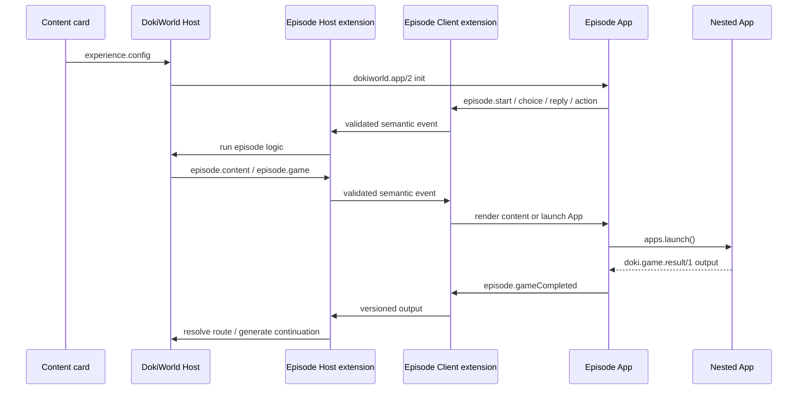

# Episode App SDK 集成

本文说明 DokiWorld Host 与 Episode App 如何通过 `@dokiworld/app-sdk/episode` 处理内容卡配置、运行时事件、嵌套 App 和结算分支。通用的 App 项目结构、manifest 生成、`dokiworld.app/2` 生命周期、构建和发布流程见 [`app-sdk-app-development.zh-CN.md`](app-sdk-app-development.zh-CN.md)。

参考实现位于 [dokiworld-apps](https://github.com/raptoravis/dokiworld-apps)：

- `storyteller`：通用 Episode renderer App，同时使用 Dialogue、Media、Speech、Storage、Character、Persona 和 Apps capability；
- `banquet-contract`：具有专用场景逻辑的 Episode App；
- `game-match3`：通过 `doki.game.result/1` 返回结算结果的嵌套 App。

## 1. Module seam

Episode extension 把 wire message 隐藏在 SDK 内，App 和 Host 只处理语义事件：

- `packages/app-sdk/src/episode.js`：运行时校验和 wire 映射；
- `packages/app-sdk/src/episode.d.ts`：双向事件和结果路由类型；
- `packages/app-sdk/tests/episode-extension.test.mjs`：方向、payload 和路由测试。

业务代码不维护 `dokiworld-app-episode-*` 字符串，也不直接监听任意 `message` 后自行解析。



## 2. Manifest 与初始化

Episode App 使用统一 App manifest，并按实际入口与能力声明配置：

- 省略 `chatLaunchable`（默认 `false`）或显式设为 `false`，避免由对话直接拉起；
- runtime 使用 `dokiworld.app/2`；
- 声明 `episode` extension；
- 通用 renderer 声明 `episodeRenderer: true`；
- `chatLaunchable` 省略或为 `false` 时，不声明仅供对话拉起使用的 `selection`。

最小 runtime 示例：

```json
{
  "runtime": {
    "protocol": "dokiworld.app",
    "protocolVersion": 2,
    "input": {
      "contract": "doki.app.storyteller-input",
      "version": 1
    },
    "outputs": [
      {
        "contract": "doki.app.session-result",
        "version": 1
      }
    ],
    "extensions": ["world", "episode", "apps", "checkpoint"]
  },
  "episodeRenderer": true
}
```

Host 在 init input 中提供当前运行所需的数据：

```ts
{
  apps: [...],
  experience: {
    characterId,
    title,
    description,
    portraitUrl,
    avatarUrl,
    tags,
    config: episodeExperience
  }
}
```

- `experience.config` 是声明式 Episode 配置；
- `apps` 是本次允许启动的 v2 App 目录；
- Character、内容卡和 persona 数据来自本次 Host context，不在 App manifest 中复制；
- input 进入 SDK 前必须是合法 JSON 值，不能包含 `undefined`、函数或循环引用。

## 3. 创建 Client 与 Host extension

App 侧：

```js
import { createAppClient } from "@dokiworld/app-sdk";
import { createEpisodeClientExtension } from "@dokiworld/app-sdk/episode";

const app = createAppClient({
  appId: "storyteller",
  extensions: ["world", "episode", "apps", "checkpoint"],
});
const episode = createEpisodeClientExtension(app);

app.connect({
  onInit: ({ input }) => loadExperience(input.data.experience),
});

const unsubscribe = app.onMessage((envelope) => {
  const event = episode.receive(envelope);
  if (!event) return;
  handleEpisodeEvent(event);
});
```

Host 侧：

```js
import { createEpisodeHostExtension } from "@dokiworld/app-sdk/episode";

const episode = createEpisodeHostExtension(host);
const unsubscribe = host.onMessage((envelope) => {
  const event = episode.receive(envelope);
  if (!event) return;
  handleAppRequest(event);
});

episode.send({ type: "episode.content", utterances });
```

App 卸载或 run 结束时释放订阅。SDK 会拒绝方向错误、未知或 payload 不合法的事件。

## 4. 配置与运行时事件的职责

```text
experience.config = beats、资源、选项、App Action 和结果路由
episode.*          = 当前 run 中玩家执行的操作和 Host 返回的增量
```

如果配置已经完全决定下一步且不需要 Host/LLM，App 可以本地执行：

- 已配置 `nextBeatId` 的静态选择；
- 不需要生成内容的本地剧情路径；
- 完整指定 App、input 和本地结果路由的 App Action。

以下场景需要发送语义事件：

| 场景 | 事件 |
| --- | --- |
| 开始或继续 Episode | `episode.start` |
| 清理进度并重新开始 | `episode.restart` |
| 需要 Host 处理的选项 | `episode.choice` |
| 自由文本回复 | `episode.reply` |
| 需要 Host 解析的 App Action | `episode.action` |
| 嵌套 App 已返回带版本结果 | `episode.gameCompleted` |
| 重新生成最近内容 | `chat.regenerate` |
| 请求回复建议 | `chat.suggest` |

Storyteller 的媒体生成应直接使用 `@dokiworld/app-sdk/media`；`chat.generateMedia` 仅属于旧 Episode 兼容路径，新业务不应继续增加对它的依赖。

## 5. 当前语义事件

Client → Host：

| 事件 | 主要字段 |
| --- | --- |
| `episode.start` | 无 |
| `episode.restart` | 无 |
| `episode.choice` | `beatId`, `optionId` |
| `episode.reply` | `playerInput`, `playerPersona?` |
| `episode.action` | `beatId` |
| `episode.gameCompleted` | `output`, `configId?` |
| `chat.regenerate` | `playerPersona?` |
| `chat.suggest` | `playerPersona?` |

Host → Client：

| 事件 | 主要字段 |
| --- | --- |
| `episode.content` | `utterances` |
| `episode.resuming` | 无 |
| `episode.error` | `code` |
| `episode.game` | `gameConfig` |
| `episode.fixedGameResult` | `result` |
| `episode.gameResolved` | `result`, `utterances` |
| `chat.regenerated` | `utterances` |
| `chat.suggestions` | `suggestions` |

`episode.gameResult`、`chat.generateMedia`、`chat.media` 和 `chat.mediaError` 仍存在于兼容类型中。新代码使用 `episode.gameCompleted` 和独立 Media capability。

## 6. 启动嵌套 App

承载 Episode 的 App 优先使用 `@dokiworld/app-sdk/apps`：

```js
import { createAppsClientExtension } from "@dokiworld/app-sdk/apps";

const apps = createAppsClientExtension(app, {
  timeoutMs: 30_000,
  launchTimeoutMs: 60 * 60 * 1_000,
});

const launch = await apps.launch({
  appId: action.appId,
  input: {
    contract: action.inputContract,
    version: action.inputVersion,
    data: action.input,
  },
});
```

`apps.launch()` 是长时间运行的交互，具有独立 launch timeout。完成状态必须带有 manifest 声明过的 output contract；取消状态不带 output。只有兼容旧 App 时才在当前 App 内创建嵌套 `createAppHost()`。

## 7. App 结果与后续模块

需要标准化结算的 App 使用 `createGameResult()` 生产 `doki.game.result/1`；承载 Episode 的 App 在不可信 seam 使用 `parseGameResult()`，并把完整 output 发送给 Host：

```js
episode.send({
  type: "episode.gameCompleted",
  configId: action.id,
  output: launch.output,
});
```

在编辑器中，App 是 Episode 内的普通流程模块。无需创建“App result Episode”；直接在 App 后添加 Dialog 或 Choice 即可。它们会自动取得该 App 的结算上下文。

持久化协议内部仍通过 Action beat 的单一 `nextBeatId` 表示 App 后续模块，以确保这些模块只在 App 完成后执行：

```json
{
  "id": "match-three",
  "position": 10,
  "goal": "完成配对挑战。",
  "action": {
    "type": "game",
    "appId": "game-match3"
  },
  "nextBeatId": "after-match"
}
```

### 7.1 可用的 `{{app.*}}` 变量

| 变量 | 值 | 示例 |
| --- | --- | --- |
| `{{app.outcome}}` | App 的结算状态 | `win`、`loss`、`draw`、`completed` 或 `exited` |
| `{{app.score}}` | 归一化后的当前得分 | `57` |
| `{{app.maxScore}}` | 归一化分数上限 | `100` |
| `{{app.metrics.<key>}}` | App 在 `metrics` 中返回的自定义指标 | `{{app.metrics.moves}}`、`{{app.metrics.points}}` |

返回标准结算结果的 App 应在 `manifest.json` 的 `result.metrics` 中声明它可能返回的指标：

```json
{
  "result": {
    "metrics": ["points", "moves", "cleared", "bestCascade"]
  }
}
```

创建 Episode 时，App 模块会读取所选 App 的声明并直接列出完整变量，例如 `{{app.metrics.points}}` 和 `{{app.metrics.moves}}`。切换 App 后列表会随之更新；未声明 metrics 的 App 只显示 `outcome`、`score` 和 `maxScore`。

`app.score` 对应 `doki.game.result/1` 中的 `normalizedScore`，范围为 0 到 100；它不是 App 内部的原始积分。原始积分、步数、连击数等 App 自定义数据应放在 `metrics` 中。例如：

```js
createGameResult({
  outcome: "completed",
  normalizedScore: 57,
  metrics: {
    points: 340,
    moves: 9,
    bestCascade: 3,
  },
});
```

上面的结果会提供 `{{app.score}}` = `57`、`{{app.metrics.points}}` = `340`、`{{app.metrics.moves}}` = `9`。

### 7.2 可以使用变量的位置

变量从 App 后的第一个模块开始生效，并沿 Choice 后续路径继续传递。可以在以下位置使用：

- AI Dialog 的 Generation prompt：变量会在请求 LLM 之前替换，LLM 可以据此生成不同反应；
- 固定 Dialog 的 dialogue、action、thought 和 narration 文案；
- Choice 的描述；
- Choice 的选项标签；
- 选择 Choice 后进入的后续 Dialog 或 Choice。

App 前面的模块不具有该 App 的结算上下文。`{{app.*}}` 只表示最近一次进入当前后续路径的 App 结果，不是全局变量。

### 7.3 DokiWorld 背包数量

`inventory` 是 DokiWorld 按账号持久化的背包系统，不属于 App 结算结果。Episode 的 AI Dialog prompt、固定 Dialog 文案、Choice 描述和选项文案都可以使用：

```text
你当前有 {{inventory.key}} 把钥匙。
```

`key` 是稳定、语言无关的物品 key。运行时从当前登录玩家的背包读取数量；未持有该物品时返回 `0`。App 不应在 `metrics` 中重复传递背包数据。

模板还支持数值比较，结果输出为小写 `true` 或 `false`：

```text
钥匙是否比地图多：{{inventory.key > inventory.map}}
得分是否超过 50：{{app.score > 50}}
步数是否不超过 10：{{app.metrics.moves <= 10}}
```

支持 `>`、`>=`、`<`、`<=`、`==` 和 `!=`。背包数量、App 的 `score`、`maxScore` 和数值型 metric 均可直接比较。若 App 字段不存在或不是数值，运行时保留原表达式，方便发现配置问题。

### 7.4 Dialog 示例

AI Dialog 的 Generation prompt 可以写成：

```text
玩家以 {{app.outcome}} 结束挑战，得分为 {{app.score}}/{{app.maxScore}}，
并使用了 {{app.metrics.moves}} 步。请根据结果生成符合角色性格的回应。
```

固定 Dialog 可以直接输出结算数据：

```text
你得到了 {{app.score}}/{{app.maxScore}} 分，结果是 {{app.outcome}}。
本局累计 {{app.metrics.points}} 点，并使用了 {{app.metrics.moves}} 步。
```

例如 `outcome=completed`、`normalizedScore=57`、`metrics.points=340`、`metrics.moves=9` 时，固定 Dialog 会渲染为：

```text
你得到了 57/100 分，结果是 completed。
本局累计 340 点，并使用了 9 步。
```

### 7.5 Choice 示例

Choice 描述：

```text
你以 {{app.score}} 分结束挑战，接下来怎么做？
```

Choice 选项标签：

```text
庆祝获得的 {{app.metrics.points}} 点
复盘刚才的 {{app.metrics.moves}} 步
接受 {{app.outcome}} 的结果并继续
```

选择其中一个选项后，该选项对应 Episode 中的 Dialog 仍可继续使用同一组 `{{app.*}}` 变量。

### 7.6 缺失值与退出结算

- 如果 `{{app.metrics.<key>}}` 指向不存在的 metric，运行时会保留原始模板文本，例如 `{{app.metrics.unknown}}`，以便作者发现拼写或配置错误；
- metric 值应为字符串、数字或布尔值；
- 玩家中途关闭 App 时，App 应通过 `onPrepareExit` 返回 `outcome: "exited"`、当时的 `normalizedScore` 和 metrics；后续模块可通过同一套 `{{app.*}}` 变量访问这些数据；
- 不要使用旧的 `{{game.*}}` 写法；统一使用与 App 类型无关的 `{{app.*}}` 命名空间。

Host 需要生成后续剧情时返回 `episode.gameResolved`；固定、本地可确定的结果可以通过 `episode.fixedGameResult` 或直接进入配置路径。`GameResult`、`doki.game.result`、`episode.gameCompleted`、`episode.gameResolved` 以及 `gameConfig` 是既有兼容协议名，不表示 App 类型分类。

## 8. Capability 组合

Episode extension 只负责 Episode 语义事件。Storyteller 的其他能力使用各自 module：

| extension | SDK module | 职责 |
| --- | --- | --- |
| `dialogue` | `@dokiworld/app-sdk/dialogue` | 对话、开场、重新生成、建议 |
| `media` | `@dokiworld/app-sdk/media` | 图片、视频生成 |
| `speech` | `@dokiworld/app-sdk/speech` | TTS |
| `storage` | `@dokiworld/app-sdk/storage` | 隔离 checkpoint、命名空间 key-value 与分页列表 |
| `character` | `@dokiworld/app-sdk/character` | 当前授权角色 |
| `persona` | `@dokiworld/app-sdk/persona` | persona 和可信选择 UI |
| `apps` | `@dokiworld/app-sdk/apps` | 嵌套 App 目录与启动 |

不要把这些能力重新包装成 Episode wire message。一个 App 可以通过 `app.onMessage()` 同时绑定多个类型化 extension，而不共享手工消息路由器。

## 9. 验证

App SDK：

```powershell
cd D:\dev\dokiworld.git
npm test --workspace @dokiworld/app-sdk
npm run typecheck --workspace @dokiworld/app-sdk
```

参考 App：

```powershell
cd D:\dev\dokiworld-apps.git\storyteller
npm test
npm run build

cd D:\dev\dokiworld-apps.git\banquet-contract
npm test
npm run build
```

DokiWorld Host：

```powershell
cd D:\dev\dokiworld.git\frontend
npm run test:run -- tests/storyteller-v2-host.test.ts
npm run build
```

测试至少覆盖：

- 双向事件方向与 payload 校验；
- App 业务源码不手写 wire message；
- manifest、Client 和 Host 的 extension 声明一致；
- 静态路径与 Host/LLM 路径的分流；
- App completed、cancelled、exited 和不同结果 route；
- 重复 completion 不导致重复剧情或持久化；
- run 结束后的 subscription、timer、iframe 和嵌套 Host cleanup。
